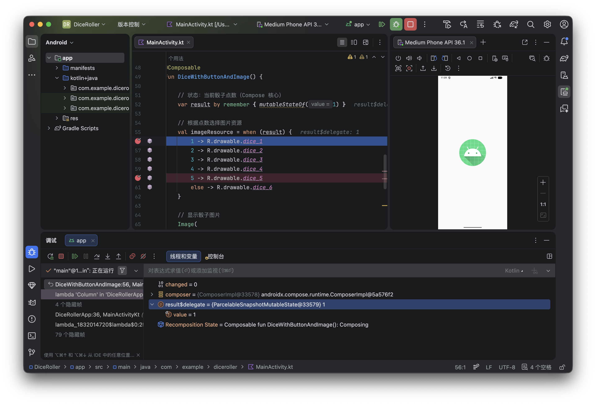

# Lab4 实验报告：Dice Roller 应用

## 一、实验内容

本实验使用 Jetpack Compose 实现一个掷骰子应用。用户点击按钮后，随机生成 1~6 的数字，并显示对应的骰子图片。同时使用 Android Studio 调试器观察程序运行过程。

---

## 二、界面结构说明

应用界面采用 Column 布局，主要包含两个部分：

1. Image：用于显示骰子图片
2. Button：用于触发掷骰子操作

整体布局居中显示，使界面简洁清晰。

---

## 三、状态管理实现

使用 Compose 状态管理机制：

```kotlin
var result by remember { mutableStateOf(1) }
```

- `remember`：保存状态，避免重组时丢失
- `mutableStateOf`：当值变化时触发 UI 更新

当 `result` 发生变化时，界面会自动刷新。

## 四、图片切换逻辑

通过 `when` 表达式实现点数到图片的映射：

```kotlin
val imageResource = when (result) {
    1 -> R.drawable.dice_1
    ...
    else -> R.drawable.dice_6
}
```

不同点数对应不同图片资源，从而实现动态图像切换。

## 五、按钮交互逻辑

按钮点击事件中生成随机数：

```kotlin
result = (1..6).random()
```

每次点击都会更新状态，从而触发界面重组。

## 六、调试过程

我在第56行设置了断点，然后运行程序。可以看到程序停在第56行，因为第52行这里设置了一个初始的状态变量为1然后保存了下来，这就导致每次运行程序第一次进来还没有点击按钮的时候就有一个默认值为1，可以看到下面的线程和变量里`result$delegate`显示的值是和56行条件的值一样。



**Resume Program**：继续运行程序

**Step Into**：可以进入函数内部

**Step Over**：逐行执行代码

**Step Out**：跳出当前函数

## 七、实验结论

1. Compose 使用“状态驱动 UI”，状态变化自动刷新界面
2. 不需要手动刷新 UI，这是声明式编程的优势
3. 调试器可以帮助理解程序执行流程和状态变化
4. 变量值变化与界面显示保持一致

## 八、遇到的问题

状态不更新

原因：未使用 mutableStateOf
解决：改为 Compose 状态变量

## 九、总结

通过本实验，我掌握了：

- Compose 基本 UI 编写
- 状态管理机制
- UI 自动刷新原理
- Android Studio 调试方法


